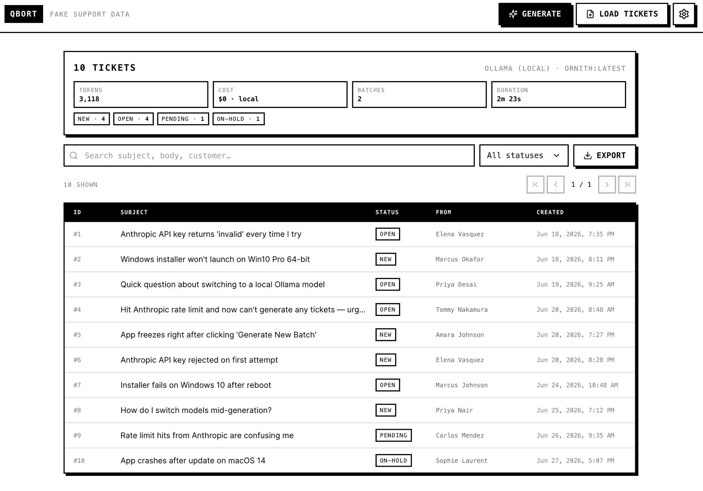

# Qbort

A local-first desktop app that generates realistic, **fake customer-support tickets** with an LLM — driven by a handful of numeric settings and a fully editable prompt. It's useful for seeding demos, load-testing a helpdesk UI, or producing sample data without touching real customer information.

Everything runs on your machine. The app only reaches out to the network to make the LLM call itself; generated tickets are written to a plain JSON file you can view in-app and export.



**Highlights**

- Two providers: **Ollama** (local, default) and **Anthropic**. (OpenAI and Google Gemini support is planned for a future release.)
- Hosted API keys are stored in your **OS keychain** (via Electron `safeStorage`) — never in plaintext config, never exposed to the UI.
- A monochrome, neo-brutalist interface with a paginated ticket viewer and per-ticket conversation threads.
- Output is a self-describing `tickets.json` (tickets + run metadata: token usage, cost, timing).

---

## Installation

### Option A — download the released binary (macOS)

1. Go to the [**Releases**](../../releases) page and download the latest `.dmg`.
2. Open the `.dmg` and drag **Qbort** into your **Applications** folder.
3. **First launch (unsigned app):** the app is currently **unsigned**, so macOS blocks it the first time you open it ("Apple cannot check it for malicious software"). The exact steps depend on your macOS version. On **macOS 14 and earlier**, right-click (or Control-click) the app → **Open**, then click **Open** in the confirmation dialog. On **macOS 15 (Sequoia) and later**, double-click the app once (it will be blocked), then open **System Settings → Privacy & Security**, find the "Qbort was blocked" message near the bottom, and click **Open Anyway**. You only need to do this once. Either way, this Terminal command clears the quarantine flag and skips the dialogs entirely:
   ```bash
   xattr -dr com.apple.quarantine "/Applications/Qbort.app"
   ```

### Option B — build and run from source

Requires **Node.js 20+** and **npm**.

```bash
git clone https://github.com/balevine/qbort.git
cd qbort
npm install

# Run the app in development (hot reload):
npm run dev

# — or — build a distributable (.dmg + .zip land in release/):
npm run dist:mac
```

Handy scripts: `npm test` (unit + integration suite), `npm run typecheck`.

---

## Usage

The app is a single screen: a ticket viewer in the middle, and a top bar with **LOAD TICKETS**, **GENERATE**, and a **gear** (settings) button. All configuration lives behind the gear.

### Choose and configure a provider

Open **Settings → Provider**. The default provider is **Ollama** so the app works out of the box with no API key.

#### Ollama (local)

1. Make sure your Ollama server is running (default host `http://localhost:11434`).
2. In the Provider panel, confirm the host and click **Fetch models**, then pick an installed model from the dropdown.

That's it — local generation is free and never leaves your machine. (Managing/installing Ollama models themselves is outside the scope of this app.)

#### Anthropic

1. Select **Anthropic** as the provider.
2. Paste your API key and click **Save**. The key is encrypted into your OS keychain; the app only ever shows whether a key is *set*, never the value. Use **Test connection** to verify it.
3. **You do not pick a model.** For hosted providers the app automatically uses a curated, cost-balanced mid-tier model — for Anthropic, this is **Claude Sonnet 5**, used by default and **not user-changeable**. Synthetic ticket generation is high-volume and doesn't need a flagship reasoning model, so the choice is fixed to keep runs fast and cheap.

### Settings

Open **Settings** (gear icon). The generation settings are:

| Setting | Default | Range | What it does |
|---|---|---|---|
| **Number of tickets** | 100 | 1 – 5000 | How many tickets to generate in a run. |
| **Include staff responses** | off | — | When off, each ticket has only the customer's opening message. |
| **Average staff responses** | 0 | 0 – 20 | Mean replies per ticket; the actual count varies around this. |
| **Number of staff members** | 10 | 1 – 100 | Size of the staff roster used to author replies. |
| **Max ticket age (days)** | 90 | 1 – 3650 | How far back message timestamps are spread — each ticket opens somewhere in this window, with replies following later. |

**Staff roster.** A staff member is a `name` + `alias`; their email is derived as `alias@company.biz`. The app ships with a default roster and resizes it as you change the staff count. This roster is the source of truth for who authors staff replies, and the `@company.biz` domain is how the viewer tells staff apart from customers.

**Default folder.** Under **Settings → Storage** you can pick the folder where ticket files are saved and auto-loaded from. If unset, it defaults to the app's user-data directory.

### Saving settings

There is **no save button** — settings persist automatically as you change them (written to a `settings.json` in the app's user-data directory). Just close the modal when you're done.

### Modifying the prompt

**This is where the generator is most customizable.** Under **Settings → Prompt** you'll find a large editor holding the creative half of the prompt: ticket categories and their percentages, sentiment mix, tone, product/domain context — whatever shapes the tickets you want. It ships with a minimal starter prompt that you expand on based on what you need.

At generation time the app **compiles** the final prompt: your text, followed by a clearly delimited block of app-enforced requirements (the exact JSON schema, how many tickets this batch should produce, the allowed status values, and the staff-response rules). Your text is never silently overridden — the requirements are *appended*. Use **Preview compiled prompt** to see exactly what gets sent to the model.

### Generating tickets

1. Click **GENERATE** in the top bar.
2. You'll see a **cost estimate** first — estimated tokens and cost (Ollama shows `$0 · local`). Nothing runs until you confirm.
3. Confirm to start. Progress streams live (tickets done, batches, retries) and you can **Cancel** at any time — tickets produced so far are still saved.
4. When the run finishes, the tickets are written to `tickets.json` in your default folder and loaded into the viewer. The file also records the run's real token usage, cost, and duration.

### Loading existing tickets

Click **LOAD TICKETS** in the top bar to open any tickets JSON file. On launch, the app also auto-loads the most recent file from your default folder, so your last run is there waiting.

### Viewing tickets

The viewer is a paginated table (100 per page) with columns for **id**, **subject**, **status**, **from**, and **created** (the ticket's opening time). You can:

- **Filter** by status and **search** free-text across the subject and every message's body and author.
- Click any row to open the **conversation modal** — the full thread rendered as messages (each with its author and timestamp), customer messages on white and staff messages on slate-grey.
- Read the **summary** at the top: counts by status, total tickets, provider/model, and the token and cost breakdown for the loaded file.
- **Export** the loaded file anywhere via the native save dialog.

---

## Contributing

Contributions are welcome, but please note:

> **Open an Issue before opening a Pull Request.** Discuss the bug or feature in a GitHub Issue first so we can agree on the approach. **PRs without an associated Issue will be closed without review.**

To work on the project locally, see [Build and run from source](#option-b--build-and-run-from-source). Before submitting, please make sure `npm run typecheck` and `npm test` pass.

---

## License

[MIT](LICENSE)
